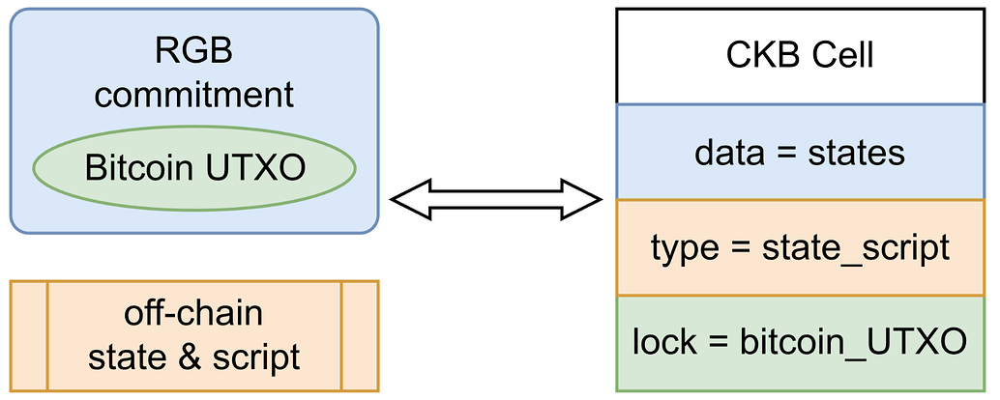
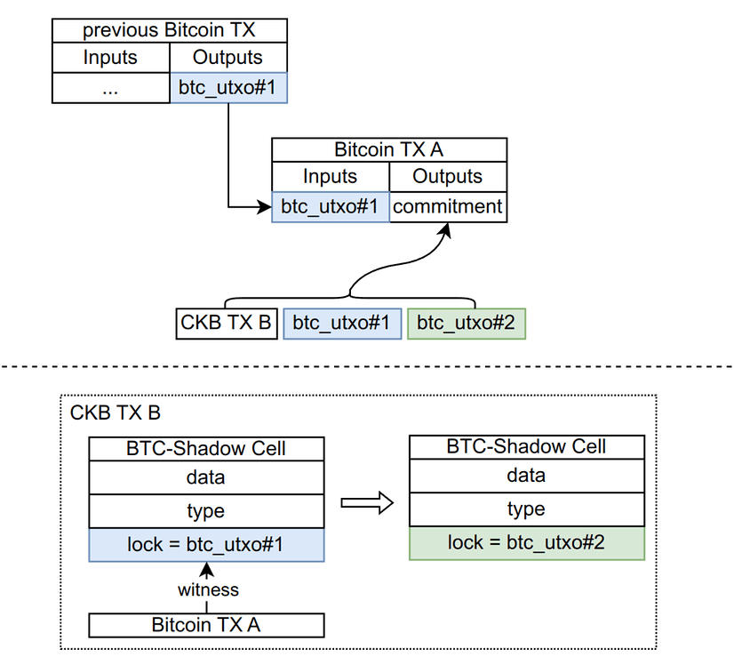
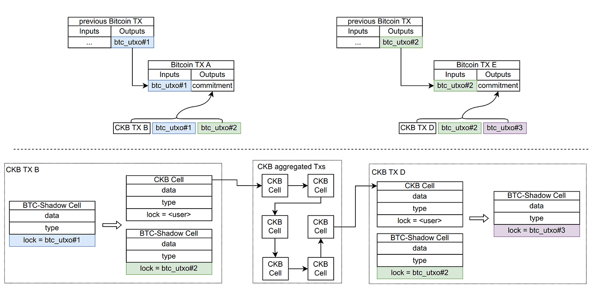
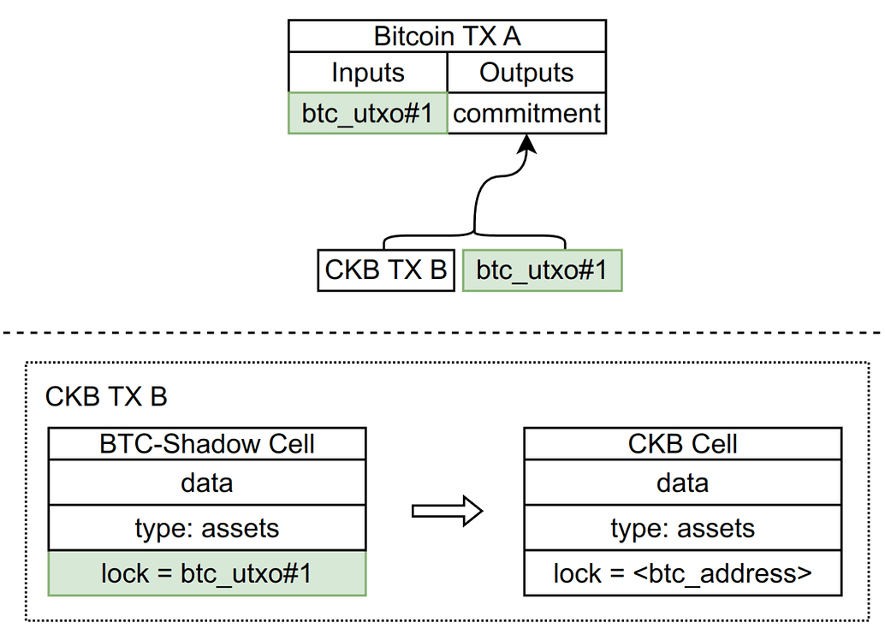
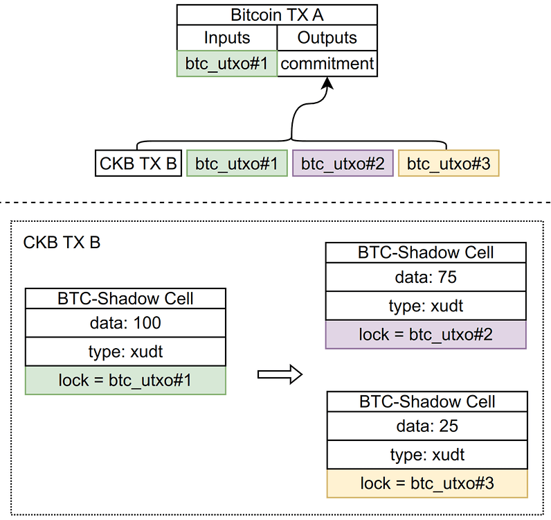
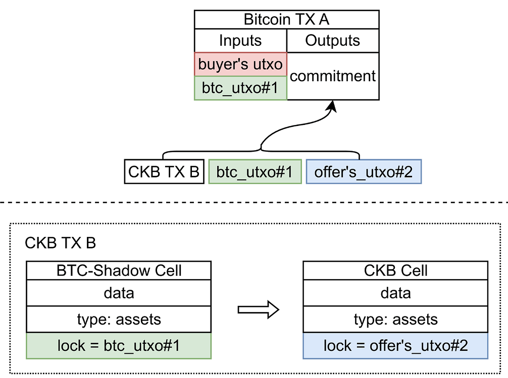

# RGB++ Protocol Light Paper (Draft)

*Cipher from CELL Studio & Nervos Foundation*

> Special thanks to [Ajian](https://twitter.com/AurtrianAjian), [cyberorange](https://twitter.com/xcshuan), [Jan](https://twitter.com/busyforking), [Shawn](https://twitter.com/ShawnMelUni), and [DaPangDun](https://twitter.com/DaPangDunCrypto) for feedback and discussion.

# **Introduction**

RGB++ is an extended RGB protocol by using single-use seals and client-side validation techniques to manage state changes and transaction verification. It maps the UTXO set of Bitcoin to the Cell of Nervos CKB via isomorphic bindings, and leverages scripting constraints on both CKB and Bitcoin chains to ensure the correctness of the state computations and the validity of the change ownership.

Addressing technical challenges encountered in the implementation of the original RGB protocol, RGB++ brings a wide array of new possibilities including client-side validation, transaction folding, shared state across contracts, non-interactive transfers, and more. It introduces Turing-complete smart contract scalability and performance to Bitcoin without the need for cross-chain transactions and without compromising security. 

### **Single-Use Seals**

The concept of **single-use seals** was [first introduced by Peter Todd in July, 2016](https://petertodd.org/2016/state-machine-consensus-building-blocks). It allows for a lock of an electronic seal on a message, ensuring that the message can only be used once. Specifically,  Bitcoin’s Unspent Transaction Outputs (UTXOs) can server as seals for messages, and the Bitcoin system’s consensus mechanism ensures that these UTXOs can only be spent once, meaning that these seals can only be opened once.

The RGB protocol uses single-use seals, which is based on Bitcoin UTXOs, to map RGB state changes to Bitcoin UTXOs ownership. This allows the Bitcoin system to guarantee ownership of the RGB state, as well as traceability of all state changes through the UTXO history. With single-use seals, the RGB protocol inherits Bitcoin's double spending protection and transaction traceability, both enforced by Bitcoin's consensus mechanism. 

### **Client-side Validation**

The RGB protocol contains user state that cannot be directly verified by the Bitcoin consensus. This requires users to utilize off-chain computation to validate that RGB state changes meet expectations. Client-side validation enables users to only validate the relevant UTXO branch history, rather than irrelevant ones. RGB ‘s state security is provided through client-side validation without reliance on any centralized third party.

### **Problems with the RGB Protocol**

While the RGB protocol has many advantages, especially in providing Bitcoin with virtually uncompromising contract extensions, there are several technical and product issues in practice.

**DA Issues**

**DA(Decentralized Authentication)** refers to whether the average user can generate or obtain proof of transaction history. When using a simple client-side product, average users lack the ability or resources to store full historical transaction data, making it difficult to provide cryptographic proof of transactions to counterparties.

**P2P Network Issues**

As an extension of Bitcoin, RGB transactions rely on a P2P network for propagation.  Users also need to interact with each other when transferring money, for example, recipients need to provide receipts. This introduces dependencies on a P2P network that is independent of the Bitcoin network.

**Virtual Machines and Contract Languages Immaturity**

The RGB protocol currently uses AluVM as its primary virtual machine. As a new model, AluVM lacks mature development tools and code examples for practice.

**Problems of Shared States and Unhosted Contracts**

The RGB protocol presently lacks sophisticated solution for the interaction of unhosted contracts, which limits multi-party interactions to realize.

### **RGB++ isomorphic bindings**

RGB++ uses isomorphic bindings to solve the problems encountered by the RGB protocol and unlock more possibilities. In RGB, the two most important components are UTXOs, determining ownership, while commitments manage state and single-use seals. In contrast, RGB++ leverages isomorphic bindings to map Bitcoin UTXOs to Nervos' Cell, ensuring ownership synchronization through the utilization of Bitcoin's UTXO locking scripts. Meanwhile, the state maintenance is managed by the data and type fields of Nervos Cells.

### **Blockchain Enhanced Client-side Validation**

All RGB++ transactions undergo synchronization, resulting in one transaction on both the BTC and CKB chains. The former is compatible with RGB protocol transactions, while the latter serves to replace the client-side validation process. Users only need to check the corresponding transaction on CKB to verify whether the state of the RGB++ transaction is correct.

Also, users also have the option not to use the transactions on the CKB chain as the basis for verifications. By utilizing the local historical transaction information of UTXO, users can independently verify the RGB++ transaction from the CKB chain (note: some functions, such as transaction folding, still need to rely on the block header hash of CKB for anti-double-spending verification).

# **RGB++ Transaction Process**

### **Off-chain Computation**

- Select the next **Single-Use Seals to be used**, e.g. btc_utxo#2;
- Perform off-chain computation to generate an RGB++ transaction (**`CKB_TX_B`**) that will be sent to the CKB;
- Get off-chain calculation: **`commitment = hash(CKB_TX_B | btc_utxo#1 | btc_utxo#2)`**.

### **BTC Transaction Submission**

Generate and broadcast a Bitcoin transaction (**`Bitcoin_TX_A`**), input **`btc_utxo#1`** for consumption,  outputting the above commitment via OP_RETURN.

### CKB Transaction Submission

- Broadcast the CKB transaction (**`CKB_TX_B`**)  mentioned above;
- The user's latest state is maintained by **`CKB_TX_B.output.data`**;
- The next state change requires the use of  **`btc_utxo#2`** and **`CKB_TX_B.output`**;

### **On-chain Validation**

- UTXOs related to Bitcoin validations can only be spent once by a given user;
- A lightweight client on CKB validates the presence of relevant Bitcoin transactions on the Bitcoin chain;
- Bitcoin's related transactions are submitted as witnesses in the CKB transaction for verification;
- CKB then verifies that the BTC transaction spent the correct UTXO;
- CKB further verifies that the BTC transaction commits to the correct commitment;
- CKB verifies that the on-chain state transition complies with the predefined contract rules.

## **RGB++ Client**

In contrast to the RGB protocol, all RGB++ transactions are on CKB and are validated by CKB script constraints. Therefore, RGB++ doesn't require a standalone client; users only need to access Bitcoin and CKB light client to verify all transactions. The CKB light client employs he PoW algorithm to verify all historical transactions and states with just a few recent block headers, which in turn facilitates the use of isomorphic bindings for verifying all RGB++ transactions.

# **Transaction Folding**

The RGB++ protocol uses isomorphic bindings between Bitcoin UTXOs and CKB Cell, enabling the implementation of Turing-complete Bitcoin UTXO transactions validated by CKB Cell.  Specifically, by further leveraging the programmable capabilities of CKB Cells, multiple CKB transactions can be corresponded with a single Bitcoin RGB++ transaction. This approach allows the low speed, low throughput Bitcoin chain to  benefit from higher scalability with the high performance CKB chain.

# **Shared State and Unhosted Contracts**

## Mediocre Implementation of Shared State

Shared state has always been a challenge in UTXO systems. Here, we will first discuss a mediocre implementation that does not consider simultaneous updates to the shared state by multiple parties. Then, we will delve into a more practical solution that allows multiple parties to operate on the shared state simultaneously.

Consider a global state cell on the CKB that manages the state shared by multiple users. Typically, it could be a staking contract for an algorithmic stablecoin, where users deposit volatile assets and receive a deposit proof. The global state is managed by an unhosted contract, meaning anyone can make changes to the state without requiring specific digital signatures from designated signatories. The implementation of an unhosted contract plays a crucial role in the decentralization and censorship resistance of the protocol.

A mediocre implementation in this context means that there is a risk that the Global state Cell is occupied by another user, causing CKB TX fail because the specified Global state utxo does not exist. As the Bitcoin TX needs to be sent out and computed into the commitment before the CKB TX, subsequent validation becomes impossible.

## **The Issue of State Contentions in Shared States and Solutions**

To address the above problem, we introduce the Intent Cell as an intermediary. Users can deterministically write down actions they wish to execute into the Intent Cell, which can interact with the global state Cell through the collaboration of a third-party aggregator, batch processing multiple parties’ intent and merging the results of the interaction into a standard shadow cell.

# **Non-Interactive Transfers**

One issue with the RGB protocol is receivers needs to provide a live UTXO as an invoice to initiate a transfer. This requires recipients stay online to complete a transaction, which increases the complexity for both user understanding and products. Instead, RGB++ leverages the Turing-complete environment by placing the interaction behavior in a CKB environment, and providing a two-step approach of send-receive to implement non-interactive transfer.

## **Send**

When user A sends assets to user B, user A only needs to know user B's address - transferring funds to that address in the RGB++ transaction without requiring user B to provide any UTXOs or invoices.

## **Receive**

The CKB lock contract has the ability to validate the digital signature of the BTC address. Therefore, the receiver can formulate a Tx C on CKB to unlock the corresponding CKB Cell and transfer the assets to their own utxo#2. This finalizes the non-interactive collection process.

# Coins

Issuing fungible assets on RGB++ requires corresponding data structure standards and consistency verification standards. We can adopt the  [xUDT standard on CKB](https://talk.nervos.org/t/rfc-extensible-udt/5337) as the isomorphic binding protocol.

## **Issuance**

There are many ways to issue fungible assets on RGB++, including but not limited to centralized distribution, airdrops, and subscriptions. The total supply of tokens can be either uncapped or pre-capped. For pre-capped tokens, a state sharing scheme can be employed during each issuance to validate that the total issued amount remains less than or equal to the preset cap.

## **Transfer**

Transferring RGB++ coins is a straightforward process, involving mapping the recipient and remaining UTXO balances to the shadow cell of CKB. Also, transferring coins can be streamlined exclusively on CKB through transaction foldings. After multiple transactions are completed, the final results will be committed to BTC.

## Privacy

The xUDT protocol is a transparent token protocol. To enhance the privacy-preserving features of RGB++ coins, we can explore token protocols that offer both amount privacy and flow privacy. For instance, the bulletproof algorithm can be employed to transform the content in data into a blinded amount, with a zero-knowledge proof demonstrating the consistency and non-negativity of the amount in each transfer transaction. This ensures that only the parties involved in a transaction possess knowledge of the specific amount in the transaction, preventing third-party observers from accessing the date of amount.

Additionally, ring signatures can be used to realize the blinding of the transfer flow. The user's coins are transferred to the ring signature obfuscator on CKB and then redirected back to the address managed by the Bitcoin UTXO. This strategy hides the historical trace of capital flow, thereby achieving enhanced privacy protection for the address.

# NFTs

## Issuance

Issuing NFT assets on RGB++ can also utilize existing CKB NFT standards, including but not limited to the [Spore Protocol](https://spore.pro/), mNFT, and [CoTA protocol](https://talk.nervos.org/t/rfc-cota-a-compact-token-aggregator-standard-for-extremely-low-cost-nfts-and-fts/6338). Taking Spore Protocol as an example, it stores all metadata on-chain, achieving 100% security in data availability. The CoTA protocol, on the other hand, is a compact token aggregator standard which compresses NFT information and holds data in 32-byte SMTs, providing ultimate cost advantages.

## **Transfer**

The transfer of NFTs in RGB++ is also very simple, similar to a coins transfer with no change.

# **Lightning Network Connectivity**

RGB, functioning as a client-side authentication protocol, inherently supports state channels and the Lightning Network. However, due to Bitcoin's scripting limitations, it is very challenging to run non-BTC Lightning networks on the Bitcoin blockchain. By adopting the RGB++ protocol, we can leverage CKB's Turing-complete scripting system to implement state channels and Lightning networks specifically for RGB++ assets. Such technology holds significant commercial potential. For example, a stablecoin payment system built on the Lightning Network can deliver cost and performance advantages that surpass those offered by centralized systems while guaranteeing decentralization and censorship resistance.

# **Examples of Applications**

## Airdrop

Given a list of addresses and corresponding amounts, we can implement a complete airdrop application using RGB++. Assuming that both the pending airdrop data and the claimed address list are stored in cell data as SMT, users can easily collect airdrops from their own addresses.

## DEX & AMM

RGB++ optimizes the UTXO structure, facilitating seamless support for UTXO-based asset exchange protocols without the need for intermediaries. Additionally, RGB++ adopts a grid trading design to enhance its Automated Market Maker (AMM) model. In comparison to Uniswap's AMM model, the grid trading model offers enhanced customization and suitability for trading UTXO-based assets.

The example above illustrates a scenario where a buyer is executing a purchase using $BTC in response to a seller's pending order for RGB++ xudt. As the transaction structure involves the buyer's utxo, containing sufficient amount of $BTC and a PBST signature, the buyer can creates a CKB transaction that meets the seller’s requirements. Afterwards, the buyer sends this signed CKB transaction to the seller. The seller then submits the BTC transaction and CKB transaction on-chain, one after the other, to complete the trade.

# **Summary**

RGB++ inherits the core idea of the RGB protocol while adopting a different virtual machine and validation scheme. Users can independently validate transactions by accessing Bitcoin and CKB light nodes, without needing a separate RGB++ client. In general, RGB++ brings Turing-complete contract scalability and achieves over ten times [performance scaling](https://www.ibm.com/docs/en/zos/2.1.0?topic=storage-tape-capacity-performance-scaling) to Bitcoin. Notably, instead of using cross-chain bridges, RGB++ implements native client-side validation for enhanced security and censorship resistance.