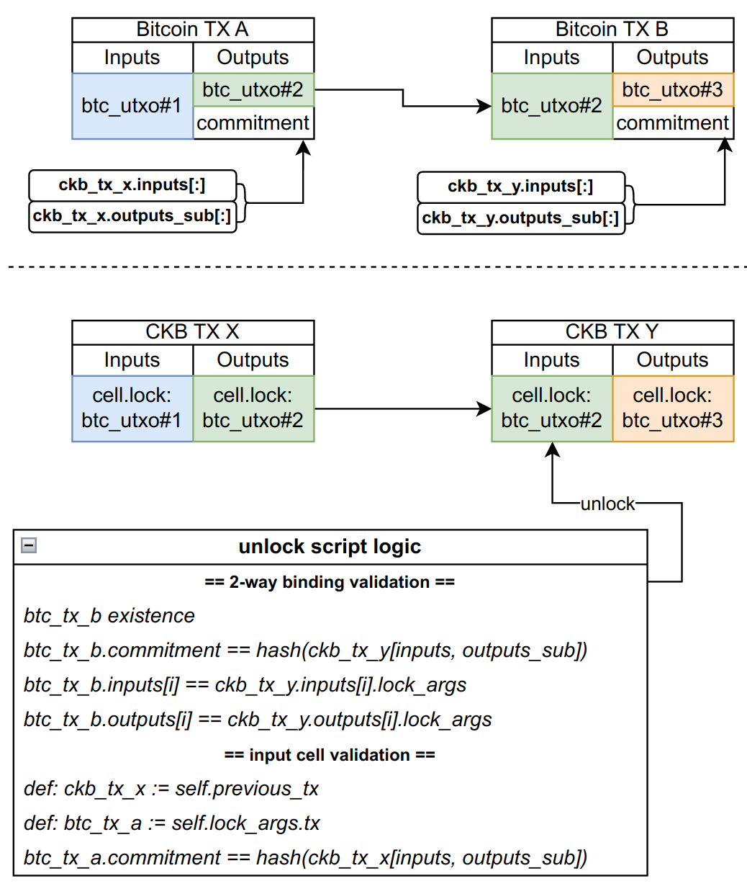

# RGB++ 合约规范

Authors: Cipher Wang
Contributors: CyberOrange, JJY, Ian, Jan

# 概述

## 关于同构绑定的要求和限制

同构绑定本质上要求 RGB++ 相关的每一个 BTC UTXO 和 CKB CELL 对应。鉴于交易的流程是先构造一个 CKB raw tx，然后把它的部分信息作为 commitment 放到 BTC TX 中，最后再将 CKB TX 上链。这里面的一些约束条件有：

- CKB Cell 的 lock 需要有完整的 BTC UTXO 信息（btc_tx + index）
- ckb_tx 的计算依赖所有的 cell 信息，后者依赖 btc_tx，如果 btc_tx.commitment 包含 ckb_tx，这就死锁了，因此，**commitment 只能包含 ckb tx 的部分信息**
    - 为了方便 ckb tx 更新手续费重发，commitment 中不应该包含 output[].capacity
- Cell 的一个额外问题是，创建 cell 时，lock 脚本并不执行，因此如果没有额外的限制或约束，任何人都可以创建多个使用相同 btc_utxo 作为 lockargs 的 cell，形式上与同一个 btc utxo 绑定
    - 所有这些 cell 显然只能有一个被解锁，因为 btc utxo 只能被使用一次，但它依然破坏了 cell <> btc_utxo 的一一绑定关系
- 解决方案：在 cell 解锁时，额外验证这个 cell 的创建 tx 的 inputs 是否和之前的 btc 交易里面的 commitment 中的 ckb_tx.inputs 一致；这等于是**分别追溯之前的 btc 交易和 ckb 交易是否绑定**。优点是思路清晰，无须创建新资产，缺点是证明可能比较复杂
- 既然解锁 RGB_lock 需要追溯上一笔 btc 交易和 ckb 交易是否绑定，那就意味着“第一笔 RGB++”交易是需要特殊处理的

# 合约需求

需要如下合约，

- RGB_lock 用来处理与 BTC TX 的同构映射的 CELL 的解锁
- BTC_TIME_lock，用来当资产从 L1 jump 到 L2 时进行锁定一定区块数再允许用户操作

## 数据结构

```yaml
RGB_lock:
	code_hash: 
		RGB_lock
	args:
    	out_index | %bitcoin_tx%
```

- RGB_lock:
    - out_index：指定一个可消费自己的 utxo 中的 index
    - bitcoin_tx: 指定一个可消费自己的 utxo 中的 btc_txid，该数值不包含在计算 commitment 内

```yaml
BTC_TIME_lock:
	args: lock_hash | after | %new_bitcoin_tx%
```

- BTC Time lock:
    - lock_hash 为目标 lockscript 的 hash[:20]
    - after 要求 new_bitcoin_tx 已经超过 after 个确认
    - 解锁后的 cell 持有人的 lock 符合 lock_hash

## **RGB_Lock 解锁**逻辑

<aside>
💡 该 Lock 放在每一个 RGB++ 资产在 CKB 的映射 Cell 上，用于 L1 地址(btc_utxo)持有 RGB++ 资产
</aside>

```yaml
 lock.args: out_index | %bitcoin_tx%
```
**验证流程**

- 存在一个与当前 CKB TX 对应的 `btc_tx`，它满足：
    - 包含在 CKB 上的 BTC 轻客户端中
    - inputs 中包含一个与要解锁的 cell.lock 对应的 btc utxo input，即  `btc_tx.inputs[i] == previous_bitcoin_tx | out_index`
    - outputs 中有且仅有一个 OP_RETURN，包含 `commitment`
- 该 `commitment` 为以下内容的 hash:
    - `N_input`, `N_output`, 描述覆盖的 inputs/outputs 个数
    - `CKB_TX.inputs[:]`, 前 `N_input` 个 inputs
    - `CKB_TX.outputs_sub[:]`, 前 `N_output` 个 outputs 包含全部数据，除了
      - 不包含`%new_bitcoin_tx% = btc_tx`，因为构造 `commitment` 的时候，尚无法计算出 `btc_tx` 的具体结果
- 验证当前 Cell 本身的合法性(通过验证上一笔交易)
    - 获取要解锁的 cell 的创建交易，记为`CKB_TX_previous`
    - 通过该 cell 的 `lock.args` 找到 `previous_bitcoin_tx` 并提取其中的 `previous_bitcoin_tx.commitment` 记为 `commitment_previous`
        - 似乎无须验证 `previous_bitcoin_tx` 是否存在于 btc 链上
    - 验证 `commitment_previous` 包含 `CKB_TX_previous.inputs[:N_input]`
    - 这样就确保了这个 cell 是由之前的 btc_tx 同构映射创建的，而不是用户随意创建的
    

    

## BTC_TIME_lock 解锁逻辑

```yaml
lock.args: var | lock_hash | after | %new_bitcoin_tx%
```

- `var` 为 1 字节版本号，默认 0
- `lock_hash` 为目标 lockscript 的 `hash[:20]`
- after 要求 `new_bitcoin_tx` 已经超过 after 个 Bitcoin 区块确认
- 解锁后的 cell 持有人的 lock 符合 `lock_hash`

# 交易逻辑

## L1 转账/操作

**定义：CKB 上输入输出的资产 cell（定义：type ≠ null） 均为 RGB_lock**

```yaml
# BTC_TX
input:
	btc_utxo_1  # =(previous_btc_tx | out_index)
	...
output:
	OP_RETURN: commitment
	btc_utxo_3  # =(new_bitcoin_tx | out_index)
	btc_utxo_4  # =(new_bitcoin_tx | out_index)

# CKB_TX
input:
	rgb-xudt:
		type:
			code: xudt
			code: RGB_type (only in Plan B, same follows)
			args: <asset-id>
		lock:
			code: RGB_lock
			args: btc_utxo_1 = (out_index | previous_btc_tx)

output:
	xudt:
		type: xudt
		lock:
			code: RGB_lock
			args: out_index = 1 | %new_bitcoin_tx%

	xudt:
		type: xudt
		lock:
			code: RGB_lock
			args: out_index = 2 | %new_bitcoin_tx%
```

## L1 → L2 Jump 操作

**定义：CKB 上输入的资产 cell 的 lock 均为 RGB lock，输出的资产 cell 的 lock 至少一个或全部为 BTC_TIME_lock，其余为 RGB_lock**

这里需要在 CKB 上引入一种新的时间锁 Lock: **BTC_TIME_lock**

```yaml
# BTC_TX
input:
	btc_utxo_1
	...
output:
	OP_RETURN: commitment
	btc_utxo_3

# CKB_TX
input:
	rgb_xudt:
		type: xudt
		lock:
			code: RGB_lock
			args: out_index | source_tx

output:
	rgb_xudt:
		type: xudt
		lock：
			code: BTC_TIME_lock
			args: lock_hash | after | %new_bitcoin_tx%

	rgb_xudt:
		type: xudt
		lock:
			code: RGB_lock
			args: out_index=1 | %new_bitcoin_tx%
```

- BTC_TIME_lock 解锁逻辑
    - 要求自身 new_bitcoin_tx 超过 after 个 BTC 确认才能解锁

## L2 → L1 Jump 操作

**定义：输入侧没有 RGB_lock，输出侧有 RGB_lock**

```yaml
# BTC TX
input:
	...
output:
	OP_RETURN: commitment
	btc_utxo

# CKB TX
input:
	rgb_xudt:
		type: xudt
		lock:
			ckb_address1

output:
	rgb_xudt:
		type: xudt
		lock:
			ckb_address2

	rgb_xudt:
		type: xudt
		lock:		
			args: btc_utxo = (out_index | %new_bitcoin_tx%)
```

注意：这里需要同步发出一笔 bitcoin 交易，满足

- `BTC_TX.commitment = hash(N_i | N_o | CKB_TX.inputs[:N_i] | CKB_TX.outputs_sub[:N_o])`
    - 注意这里要兼容前面的 `RGB_Lock.commit` 的内容规定
- `CKB_TX.outputs[RGB_CELL_i].lockargs.utxo == BTC_TX.outputs[i]`

**但注意，这个动作中的约束不是强制的**，就是任何人都可以发一个这样的 rgb cell，或者btc commitment，但是：

- 如果 commitment 对不上，这个创建的 rgb cell 在后续无法花费
- 不可能存在两个交易生成的 rgb cell 与一个 btc 对应（因为他们的 ckb.input 不相同）

## 第一笔 RGB++ 资产发行

与 [L2 → L1 Jump 操作](https://www.notion.so/L2-L1-Jump-e9562b5b6cc24861a86f758c8e04ddd6?pvs=21) 完全相同，不同点在于

- 你可以可选地使用特殊的 input.lock 来约束发币行为。参考 [RGB++ 首个 coin 发行服务需求](https://www.notion.so/RGB-coin-7ef49352d7264f2c97cd5f810da2fdc0?pvs=21)
- 未来生成的链外 CSV 证明不同（前者的证明链条类似 BTC-CKB-BTC 这种），后者只会有 CKB-BTC

第一笔资产发行中，针对 `BTC_TX.commitment` 的约束不必要出现在脚本约束中，用户构造交易时满足即可。因为如果交易发起方作恶，没有按照规则填写 commitment，后续生成 RGB_Cell 由于需要验证上一笔交易，就会出错无法验证

# 其他问题

## 手续费问题

考虑一笔 RGB++ L1 交易，用户使用 Bitcoin 钱包（不论是 unisat 还是 joyid 的 btc 签名器）发起一笔交易，此时需要先

- 构造一笔虚拟 CKB 交易，记为 RAW_CKB_TX
- 发起与之对应的 BTC 交易，记为 BTC_TX，此时需要用户支付足够的 bitcoin 手续费，以及为接受者提供一个或多个 UTXO（有最小值，例如 536 sat）
- 发起与之对应的 CKB 交易，此时需要支付 CKB 的手续费，以及**为接受者提供一个或多个 Cell**

### 自有 CKB

用户需要在 BTC 钱包内拥有足额 Bitcoin，同时在自己管理的一个 CKB 钱包中，拥有足额的 CKB。

- 构造 RAW_CKB_TX 时，在 input 位置加入自己的 capacity cell，output 加入找零
- 发起 Bitcoin 交易后，除了构造 witness 用于解锁 RGB_lock，也需要签名上面的 capacity cell，用来解锁这些 input cell
    - 用户只能在 JoyID 中操作，需要按两次指纹

### 代付 CKB

用户只需要在 BTC 钱包内拥有足额 Bitcoin

- 构造 RAW_CKB_TX 时，先不考虑 capacity，构造 PRE_CKB_TX，发送给 paymaster
- paymaster 增加部分 input output 后，返回
    - RAW_CKB_TX 的内容（output.lockarg.btc_utxo 除外）
    - paymaster 的 btc_address, btc_amount
    - 对交易 RAW_CKB_TX 的签名
        - 考虑到 RAW_CKB_TX 不是完整的待签交易，因此 paymaster 使用的 lock 也需要是相对**特殊的 lock**
- 构造 BTC_TX，输出位置增加 UTXO(btc_address, btc_amount)，并签名
- 发起 Bitcoin 交易后，构造 witness 用于解锁 RGB_lock，并提供 paymaster 的 cell 的签名，即可完成上链

**注：考虑到代付系统的复杂性，似乎用户始终使用自有 CKB 是个更好的解决方案**

## 状态异常

考虑异常问题，例如用户构造了 CKB 上的交易（不含 lock 参数中的`%bitcoin_tx%`），然后发起了 BTC 交易，获得 `%bitcoin_tx%` 后，发起 CKB 交易。这个过程中，分别考虑五种情况：

1. BTC 交易被 reorg 又重新被打包入块
2. CKB 交易被 reorg 又重新被打包入块
3. CKB 交易被双花替代
4. BTC 交易被双花替代
5. BTC CKB 交易被同时双花替代

### 区块分叉无双花（1，2）

由于交易的确定性，1，2 情况不会影响用户资产和后续交易。

### CKB 交易双花（3）

对于 L1，L1→L2 的 RGB++  交易均存在同构绑定，CKB 交易事实上是被 BTC 交易定死了，不可能出现双花替代的情况。

**对于 L2→L1 的交易，**不存在同构绑定，用户在 CKB 上发起交易后，如果 CKB 交易被 revert，则原有的 Bitcoin_utxo 对应的 CKB Cell 就不存在了。后续交易无法构造，用户只需要等待 24 个 CKB 区块即可确认不会出现 reorg，这样就不会造成安全性问题。

### BTC 交易被双花替代（4）

对于 L1 交易：由于收款方的 utxo 由发送方的同构绑定 bitcoin utxo 提供。一旦 btc 交易被 revert，事实上后续相关的所有 utxo 在 CKB 上都无法解锁，造成资产锁定。对于攻击者来说属于损人不利己。假设这种问题不会出现，即使出现也不影响第三方

对于 L1→L2 交易，一旦 btc 交易被 revert，CKB 上就会出现两个对应绑定的交易，造成双花。此时我们通过引入 **BTC_TIME_lock** 强制要求 L2 的资产在 BTC 交易后的 6 个区块才能使用。届时，如果相关 BTC 交易被 revert 了，资产也无法使用。

### BTC CKB 交易被同时双花替代（5）

规则允许