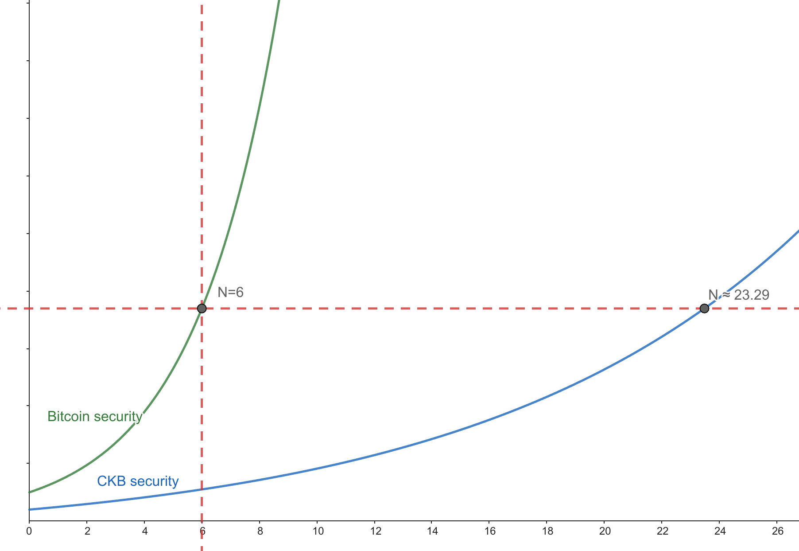
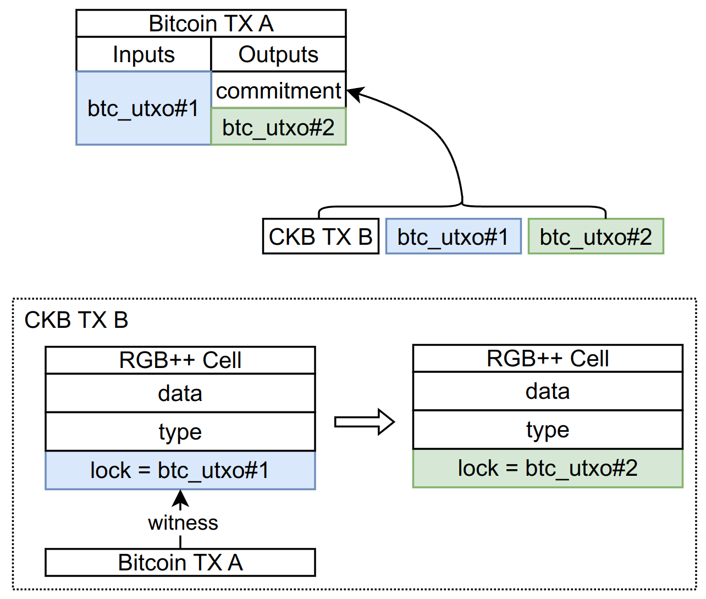
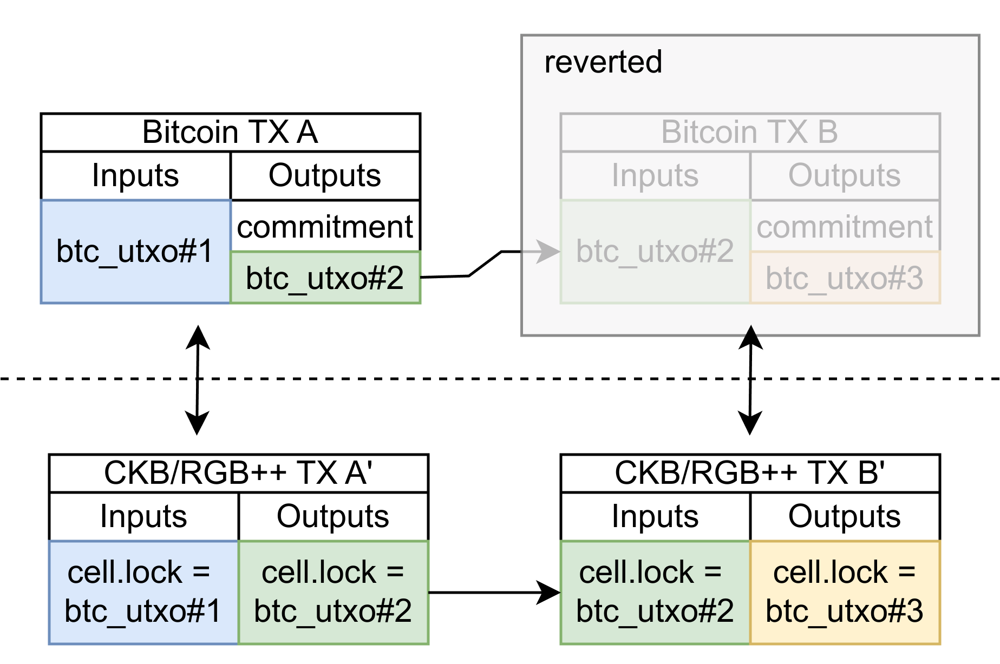
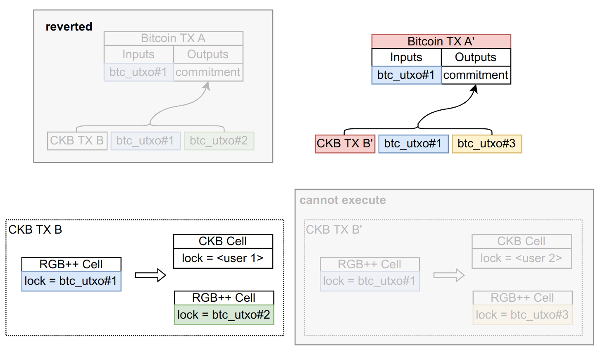
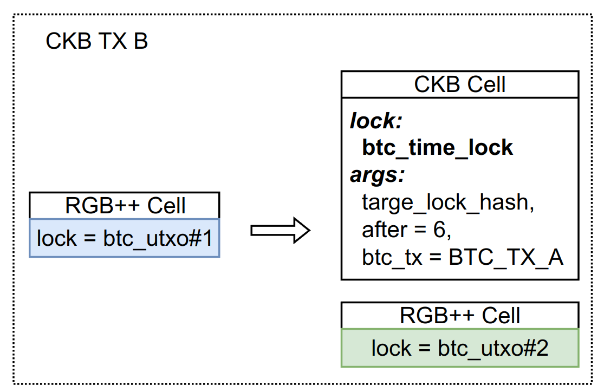

# A Deep Dive into RGB++: Security Analysis 

*Cipher from CELL Studio & Nervos Foundation*

> Special thanks to [Ren Zhang](https://scholar.google.com/citations?hl=en&user=JB1uRvQAAAAJ), [Ian](https://github.com/doitian), and [c4605](https://talk.nervos.org/u/c4605/summary) for feedback and discussion.
> The RGB receiver optimization approach is inspired by [Jason Cai](https://twitter.com/CryptoStwith).

## **PoW is More Secure Than You Think**
The security concern in Proof-of-Work (PoW) lies in block revert/reorg which can enable double-spending attacks. Consider a network with an honest miner, a user’s status and assets would remain accurate, then only the block reorganization there could cause losses from double-spending. Consequently, the core security assumption of PoW is that transactions are highly unlikely to be reverted after N blocks. In Bitcoin’s case, 6 or fewer blocks are typically considered secure enough against double-spends.

Obviously, Bitcoin transactions with 6 confirmations are more secure than 1 confirmation. So is there a linear relationship between the number of PoW confirmations and security? No, **the difficulty of overturning a block increases exponentially as the depth of the block increases**. The precise parameters of this exponential security growth have been analyzed in dozens of research papers. What has become clear is that “N confirmations” provide greater security than previously thought.

According to calculations by Dr. [Ren Zhang](https://scholar.google.com/citations?hl=en&user=JB1uRvQAAAAJ), assuming that the adversary’s Hash rate accounts for 30%, CKB would need to maintain a 2.5% orphan block rate and require 23.29 confirmations to match the security of 6 confirmations on Bitcoin with a 0% orphan rate. This equivalence relationship provides a convenient way to discuss the security of various typical operations in the RGB++ protocol.

***Schematic diagram of PoW security (non-theoretical calculation)***

## **Security of RGB**
RGB binds the status and contracts of RGB to Bitcoin UTXO using single use seals and client-side validation methods. This provides an extension of Turing-complete scalability for Bitcoin. There are two types of transaction security: 1) Correctness of state calculations, 2) Transaction certainty. Client-side validation ensures the correctness of state calculations. Everyone is responsible for their own state and does not rely on any third party. Single-use seals based on BTC UTXO ensure that the difficulty of double spending on RGB matches that of double spending on Bitcoin. Therefore, we can say that **RGB inherits 100% of Bitcoin’s security**. Users can achieve their desired security threshold by waiting for the corresponding number of Bitcoin confirmations.

## **Security of RGB++ Protocol**
### **L1 Transaction Security**
L1 transactions for RGB++ refer to that the “holder” of UTXOs for RGB++ transactions is the holder of Bitcoin’s UTXOs. That is, only consuming Bitcoin UTXO can operate or update RGB++ UTXO. In this model, although each RGB++ transaction initiates a parallel CKB transaction, its security does not rely on CKB. CKB is only utilized for data availability and status disclosure purposes. Therefore, the L1 transaction security of RGB++, identical to RGB protocol, fully inherits the security of Bitcoin.

### **L2 Transaction Security**
L2 transactions occur 100% on CKB, meaning CKB is responsible for 100% of L2 security. However,due to the non-linear security scaling of PoW chains previously mentioned, 24 block CKB confirmations provide equivalent security to 6 confirmed Bitcoin transactions. Therefore, we could believe that L2 transaction security matches L1 transaction security(more block confirmations needed but cost shorter time for the actual confirmation).

The prerequisite for realizing this equivalent security is that the RGB++ isomorphic mapping chain must be PoW. If it were a PoS chain, its security upper bound would be limited by the staking amount of PoS no matter the number of confirmed blocks, which cannot compare to Bitcoin’s security.

### **Jump Operation**
The RGB++ protocol enables users to seamlessly transfer their assets between Bitcoin and CKB in either direction at any time. There is no need for a cross-chain bridge during the switching process, and any reliance on multi-signature parties. This transition of assets or state between chains is called a Jump operation.

Before and after the Jump operation, the core points that affect the security of the RBG++ protocol are:

Single-use seals, from using Bitcoin UTXO to using CKB UTXO, or vice versa;
Unchanged client verification data on CKB as they are the isomorphic binding transactions on CKB.
During a Jump, users need to wait for sufficient block confirmations on both Bitcoin and CKB to to ensure the security.

### **Optimization of RGB Payee UTXO**
Considering the original RGB protocol, in order to achieve transaction privacy, the payee of the RGB transaction initiated on Bitcoin (i.e. Bitcoin UTXO) is not consistent with the output of theBitcoin transaction. This makes it impossible for observers to track RGB transactions similarly to Bitcoin transactions.

In contrast, in the RGB++ protocol, all transactions on RGB++ layer are isomorphically bound and published on CKB. Although it greatly simplifies user transaction verification, it, regrettably, compromises the anonymity of the orginal RGB protocol (the RGB++ protocol can leverage the privacy layer on CKB for [more powerful privacy attributes](https://forum.grin.mw/t/a-draft-design-of-mimblewimble-on-nervos-ckb/7695)). To address this, RGB++ adjusts the payee’s role, eliminating the need for the payee to provide their UTXO in advance. Only a payment address is required, as the RGB++ transaction will generate a UTXO pointing to the payee during a BTC transaction. In this way, non-interactive transfers can be completed, greatly simplifying the user’s operation process. Please Note that certain simplifications are made in the diagram below: to achieve isomorphic binding, some fields present in BTC and CKB transactions are excluded from commitment to prevent mutual inclusion conflicts.

### **Transaction Sequencing**
As outlined above, the optimization of RGB non-interactive transfers, serves a dual purpose by significantly enhancing user experience and playing a pivotal role in the optimization of transaction confirmations.

First, for an honest user, block reorgs on the BTC chain often occur but do not affect the validity of their transactions or associated RGB++ assets and status on the CKB chain, as long as they do not intentionally initiate double spending.

Consider an L1 RGB++ transaction, for better user experience, we allow a single block of BTC transactions to be confirmed to initiate isomorphic transactions, that is, construct a synchronized RGB++ asset transaction on CKB. At this point, a malicious user could construct a new BTC transaction to replace a previous BTC TX B, which means that CKB TX B’ cannot find the corresponding BTC transaction. However, the new CKB TX B’ has already been committed to the CKB chain. As a result, the isomorphic mapping cell on CKB of btc_utxo#2 which was double spent on BTC has been consumed in CKB TX B’. Even if the malicious user successfully double-spend utxo on BTC, he cannot double-spend the corresponding assets on RGB++. At the same time, the RGB++ cell output generated by the previous transaction (lock is btc_utxo#3) is also locked due to the failure of the chain transaction. In summary, malicious users cannot benefit from BTC double-spends and will cause their own RGB++ assets to become unusable.

For an L2 RGB++ transaction which runs 100% on CKB, we only need to comply with the original transaction logic. In other words, we can have a continuous experience within the dApp.

Finally, consider a “Jump” operation where a user transfers RGB++ assets from a Bitcoin UTXO to a CKB address and subsequent operations continue on CKB. In this case, we need to consider the problem of asset duplication on CKB caused by Bitcoin TX revert.

Taking the above transaction, where BTC_TX_A on Bitcoin is isomorphically bound to CKB_TX_B on Nervos CKB, as an example. If BTC_TX_A gets reorganized as BTC_TX_A’, the isomorphic transaction CKB_TX_B’ cannot be validated through the CKB consensus, as it relies on the input (lock = btc_utxo#1), which has already been utilized in CKB_TX_B. Consequently, the isomorphic binding of transactions on BTC and CKB fails. Please note that if isomorphic binding fails while all related assets are locked, we do not consider it a security issue. This failure results from transaction initiator’s intentionally attacks, it should not be a problem that all his assets are permanently locked.

But as shown in the above figure, there are two outputs on CKB. The lock on the RGB++ cell is btc_utxo#2. Since it depends on the old BTC transaction that has been reverted, there is no issue with it being permanently locked. However, the other CKB cell remains unaffected, which brings a security risk.

Therefore, we introduce a new lock, tentatively named btc_time_lock, aiming to mitigate the issue by incorporating additional locking logic.

### **BTC Time Lock**
There are three core parameters of btc_time_lock: lock_hash，after，和 bitcoin_tx. Its specific meaning is: “Only when the bitcoin_tx specified in the parameter is confirmed by more than after btc blocks, this cell can then be unlocked. After unlocking, it needs to be replaced with the lock script (CKB address) specified by lock_hash.” Let’s use the above example to see how btc_time_lock works.

Same as the previous discussion, if BTC_TX_A is reverted, the corresponding RGB++ Cell will be permanently locked. The other CKB Cell is placed in btc_time_lock as required, with the condition for their unlock being the confirmation of BTC_TX_A by 6 blocks. Then, apparently, BTC_TX_A is permanently locked since it does not exist. On the other hand, if BTC_TX_A still exists after the confirmation from six BTC blocks, then the CKB Cell can function normally.

## **Summary**
In summary, the RGB++ protocol provide a level of security equivalent to Bitcoin, whether having jump operations on Layer 1 or Layer 2. Jump between L1 and L2 requires the additional step of locking assets for six or more BTC blocks, ensuring consistent security approach when across layers. The RGB++ protocol complements the BTC network by providing Turing-complete functionality and enhanced performance without compromising security.

## References
[A Deep Dive into RGB++: Security Analysis](https://talk.nervos.org/t/a-deep-dive-into-rgb-security-analysis-translation/7816)